# Organized Trips Management System

Adi Itzkovich
Gili Shechter

## Table of Contents  
- [Phase 1: Design and Build the Database](#phase-1-design-an+6d-build-the-database)  
  - [Introduction](#introduction)  
  - [ERD (Entity-Relationship Diagram)](#erd-entity-relationship-diagram)  
  - [DSD (Data Structure Diagram)](#dsd-data-structure-diagram)  
  - [SQL Scripts](#sql-scripts)  
  - [Data](#data)
  - [Backup](#backup)  
- [Phase 2: Integration](#phase-2-integration)
  - [Quries](#Quries)  
  - [Constraint](#Constraints)  
  - [Backup](#Backupfile)
 - [Phase 3: Programming](#phase-3-Programming)
  - [Quries](#Quries)  
  - [Constraint](#Constraints)  
  - [Backup](#Backupfile)  

## Phase 1: Design and Build the Database  

### Introduction

The **Organized Trips Managemen**t System is designed to efficiently manage all aspects of organized trips, including participants, tour guides, hotels, destinations, flights, and schedules. This system ensures seamless organization and tracking of essential trip details, such as participant information, travel logistics, accommodations, and assigned guides.

#### Purpose of the Database

This database serves as a structured and reliable solution for organizing trips by:

- **Managing trip participants**, including registration, contact information, and trip history.

- **Tracking tour guides**, assigning them to specific trips.

- **Storing hotel details**, including availability and trip allocations.

- **Recording flight information**, linking flights to trips and participants.

- **Managing trip destinations**, tracking locations visited per trip.

- **Ensuring smooth coordination**, with an integrated system for all travel elements.

#### Potential Use Cases

- **Trip Administrators** can use this database to organize trip schedules, manage participant lists, and assign guides.

- **Participants** can register for trips, track their itinerary, and receive notifications.

- **Tour Guides** can view their assigned trips and access participant details.

- **Hotels & Airlines** can coordinate with the system for room reservations and flight schedules.

- **Management & Staff** can use the database for planning, record-keeping, and customer support.

This structured database helps improve organization, communication, and efficiency in managing organized trips.
###  ERD (Entity-Relationship Diagram)    
  

###  DSD (Data Structure Diagram)   
  

###  SQL Scripts  
Provide the following SQL scripts:  
- **Create Tables Script** - The SQL script for creating the database tables is available in the repository:  

📜 **[View `create_tables.sql`](א/createTable.sql)**  

- **Insert Data Script** - The SQL script for insert data to the database tables is available in the repository:  

📜 **[View `insert_tables.sql`](א/insertTables.sql)**  
 
- **Drop Tables Script** - The SQL script for droping all tables is available in the repository:  

📜 **[View `drop_tables.sql`](א/dropTables.sql)**  

- **Select All Data Script**  - The SQL script for selectAll tables is available in the repository:  

📜 **[View `selectAll_tables.sql`](א/selectAll.sql)**  
  
###  Data  
####  First tool: using [mockaro](א/mockarooFiles) to create csv file
#####  Entering a data to customer table
-  customer id scope 1-400
📜[View `customerMock_data.csv`](א/mockarooFiles/customer.csv)
#####  Entering a data to destination table
-  destination zipcode scope 1-400
📜[View `destinationMock_data.csv`](א/mockarooFiles/destination.csv)
#####  Entering a data to flight table
-  flight flightid scope 1-400
📜[View `flightMock_data.csv`](א/mockarooFiles/flight.csv)
#####  Entering a data to guide table
-  guide guideid scope 1-400
📜[View `guideMock_data.csv`](א/mockarooFiles/guide.csv)
#####  Entering a data to hotel table
-  hotel hotelid scope 1-400
📜[View `hotelMock_data.csv`](א/mockarooFiles/hotel.csv)
#####  Entering a data to include table
-  include
📜[View `includeMock_data.csv`](א/mockarooFiles/include.csv)
#####  Entering a data to invite table
-  invite
📜[View `inviteMock_data.csv`](א/mockarooFiles/invite.csv)
#####  Entering a data to trip table
-  trip tripid scope 1-400
📜[View `tripMock_data.csv`](א/mockarooFiles/trip.csv)

#####   Entering a data to guide table
-  guide guideid scope 1-400
-  Formula of guide

📜 [View `costumerMock_data.csv`](א/mockarooFiles/customer.csv)

results for  the command `SELECT COUNT(*) FROM guide;`:
 

####  Second tool: using [python](א/Programing). 
#####  Entering a data to customer
-  Group Number  scope 700-1200
📜[View `insertDat.py`](א/Programing/insert.py)
-  Data
📜[View `insertDat.sal`](א/insertTables.sql)

####  Third tool:[excel File](א/excel)
- Excel file customer table 200 record
📜[View `insertDat.py`](א/excel/travel_database.xlsx)

- Convert to csv file
📜[View `insertDat.py`](א/excel/customer1.csv)

### Backup 
-   backups files are kept with the date and hour of the backup:  

[backupFile](א/backup_3.29.25.backup)

## Phase 2: Quries
📜[View `AllQuries.sql`](ב/Quries.sql)
#### Select quries:
-1. קיימים לקוחות שדורשים מדריך עם ניסיון. השאילתה מחזירה את רשימת המדריכים שליוו לפחות 3 טיולים שונים ולפחות שניים מהם ליעדים שונים. התוצאה כוללת את מזהה המדריך, שם המדריך, מספר הטיולים שהדריך ומספר היעדים השונים, ממוינת לפי כמות הטיולים שהדריך, מהגבוה לנמוך.📜[View `select1.sql`](ב/Quries.sql/Quries1.sql)

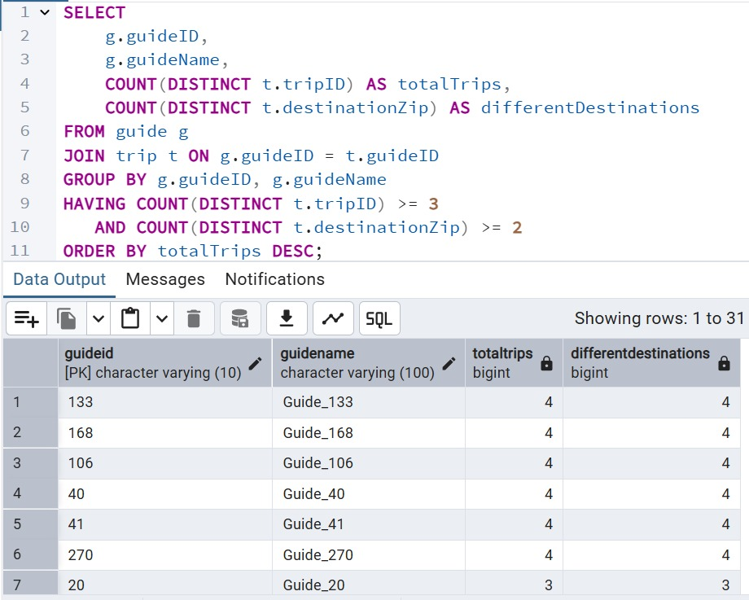

-2.חברת הטיולים רוצה לארגן טיולים למדינות שבהם כמות הלקוחות שהגיעו היתה גבוהה. השאילתה מחזירה את היעדים שבהם סך הלקוחות היה מעל 130, כולל את מזהה היעד, המדינה, כתובת היעד וסך כל הלקוחות, ממוינת לפי סך הלקוחות, מהגבוה לנמוך. 📜[View `select2.sql`](ב/Quries.sql/Quries2.sql) 
 

-3.חברת הטיולים רוצה למיין את התאריכים של החודשים שהיו בהם הכי הרבה טיולים ולקוחות- זאת אומרת הכי הרבה הכנסות כדי לנסות לשחזר את ההצלחה.השאילתה מחזירה את החודשים שבהם היו גם הכי הרבה טיולים וגם הכי הרבה לקוחות בסדר יורד. השאילתה מחזירה את החודש, השנה, כמות הלקוחות וכמות הטיולים.📜[View `select3.sql`](ב/Quries.sql/Quries3.sql)

-4.חברת הטיולים רוצה למצוא לקוחות חוזרים שהביאו איתם מספר גבוה של אנשים כדי להתקשר אליהם לגבי עוד טיולים.השאילתה מחזירה את שמות הלקוחות, מזהי הלקוחות, מספר הטיולים שהם השתתפו בהם, ואת מספר הלקוחות שהם הביאו, עבור לקוחות שהשתתפו ביותר מ-3 טיולים שונים והביאו יותר מ-5 לקוחות בכל טיול.📜[View `select4.sql`](ב/Quries.sql/Quries4.sql)

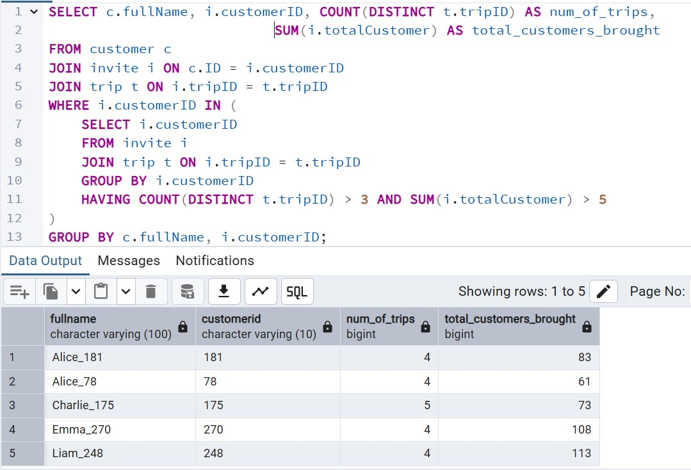

-5.חברת הטיולים מעוניינת לזהות יעדים פחות מבוקשים כדי לתכנן עבורם חבילות אטרקטיביות יותר. השאילתה מאתרת את המיקודים והמדינות של אותם יעדים שאליהם הוזמנו פחות מ-10 לקוחות ייחודיים בסך הכל.📜[View `select5.sql`](ב/Quries.sql/Quries5.sql)

-6. חברת הטיולים רוצה לבדוק איזה מדריך פנוי באוגוסט ובאיזה מדינות הוא כבר הדריך כדי לשבץ אותו לטיולים במדינות האלה באוגוסט. השאילתה מחזירה רשימה של מדריכים שלא הובילו טיולים באוגוסט, כולל מזהה, שם ומספר טלפון שלהם, וכן את רשימת המדינות בהן הם כן הובילו טיולים בחודשים אחרים.📜[View `select6.sql`](ב/Quries.sql/Quries6.sql)

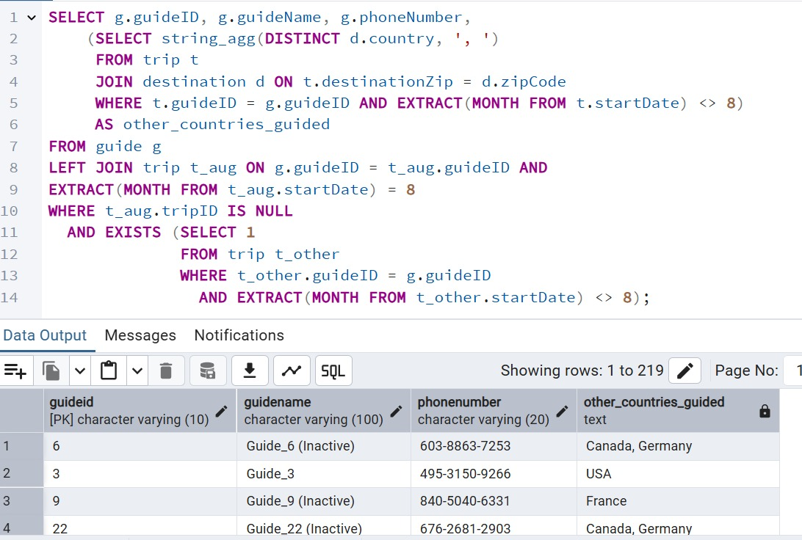

-7. חברת הטיולים רוצה את רשימת המלונות שלא היתה בהתם תפוסה מלאה ברבעון הראשון של 2024.השאילתה מחזירה שמות ומספר חדרים של בתי מלון שהיו פעילים ברבעון הראשון של 2024. היא מסננת רק את אותם בתי מלון שלא היתה בהם תפוסה מלאה כאשר בכל חדר יש 2 לקוחות.📜[View `select7.sql`](ב/Quries.sql/Quries7.sql)

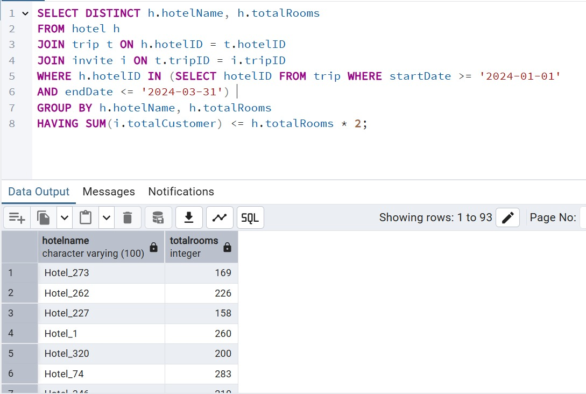

-8. חברת הטיולים רוצה לזהות יעדים אהובים אצל לקוחות מסוימים כדי להציע להם הצעות טיול ליעדים אלו. השאילתא  מחזירה רשימה של לקוחות והמדינות אליהן הם טסו לפחות פעמיים📜[View `select8.sql`](ב/Quries.sql/Quries8.sql)

#### Delete quries:
-1.השאילתה מוחקת את כל הטיולים שהתאריך חזרה מהם היה לפני יותר מ15 חודשים.📜[View `Delete1.sql`](ב/Quries.sql/Quries9Delete.sql)

#### Before

#### After

-2. השאילתא מוחקת את כל המדריכים שלא הנחו טיול בשלוש השנים האחרונות. היא עושה זאת על ידי חיפוש המדריכים שהיו קשורים לטיול בתקופה הזו, ומחיקת כל שאר המדריכים 📜[View `Delete2.sql`](ב/Quries.sql/Quries10Delete.sql)

#### Before

#### After

-3.השאילתא מחפשת את כל הטיולים שאין להם שום לקוח שנירשם לטיול ובנוסף שתאריך ההתחלה עבר- החברה רוצה לדעת איזה טיולים הם רלוונטים ולכן טיולים שכבר עבר זמנם ולא נרשמו אליהם לקוחות הם לא רלוונטים לעומת טיולים שעבר זמנם ונרשמו אליהם לקוחות כיון שהפרטים עוד חשובים
📜[View `Delete3.sql`](ב/Quries.sql/Quries11Delete.sql)

#### Before

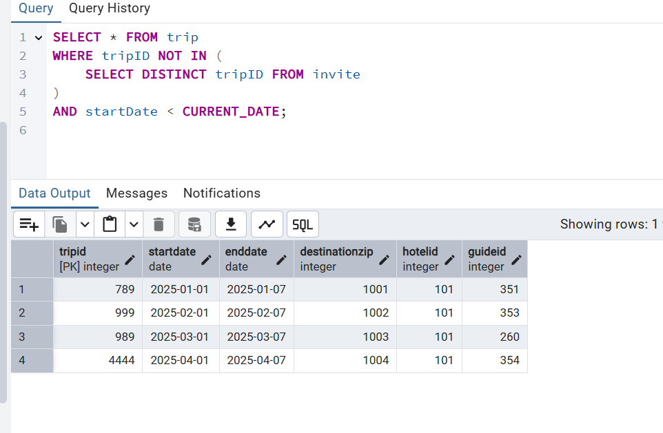

#### After

#### Update quries:
-1.השאילתא מחפשת טיולים שבהם המלון שלהם מלא מדי ומבצע עדכון כך שכל טיול כזה יקבל מלון אחר באותה מדינה, שיש לו מספיק חדרים עבור כל הלקוחות שהוזמנו.📜[View `Update1.sql`](ב/Quries.sql/Quries12Update.sql)

#### Before

#### After
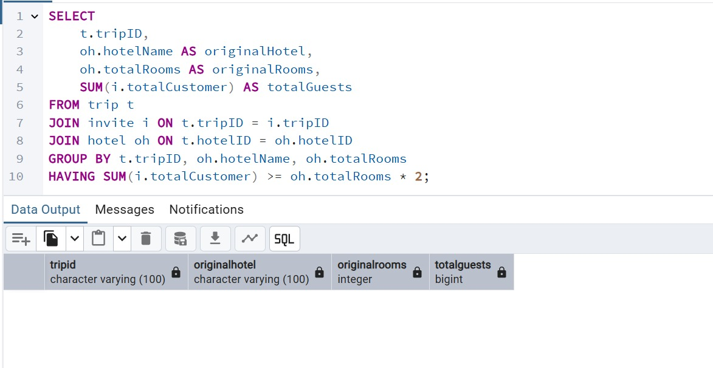

-2.השאילתה  מעדכנת את המדריך של טיולים המשובצים למדריכים עמוסים (להם 2 טיולים או יותר), ומחליפה אותם במדריך אחר שיש לו פחות מ-2 טיולים בסך הכל. העדכון מתבצע רק אם קיים מדריך פחות עמוס זמין.📜[View `Update2.sql`](ב/Quries.sql/Quries13Update.sql)

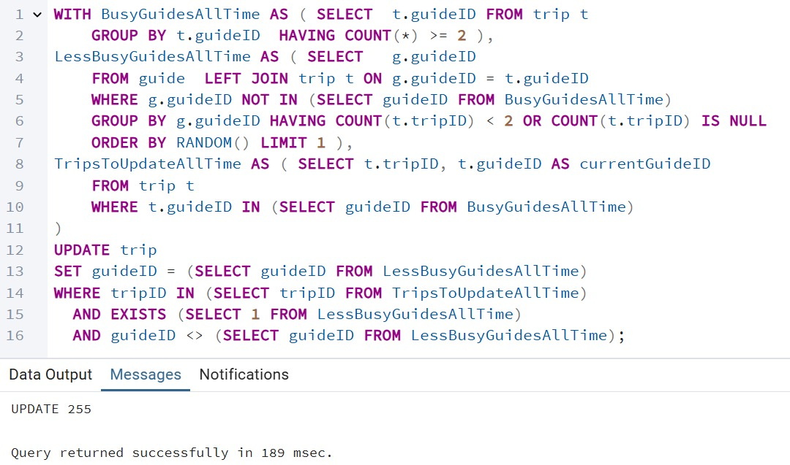

#### Before

#### After

-3.החברת הטיולים החליטה שטיולים בארה"ב לא יתחילו בשבת. השאילתה  מעדכנת את תאריך ההתחלה של טיולים. אם תאריך ההתחלה הוא יום שבת והיעד של הטיול הוא בארה"ב , תאריך ההתחלה יוזז ליום ראשון.📜[View `Update3.sql`](ב/Quries.sql/Quries14Update.sql)

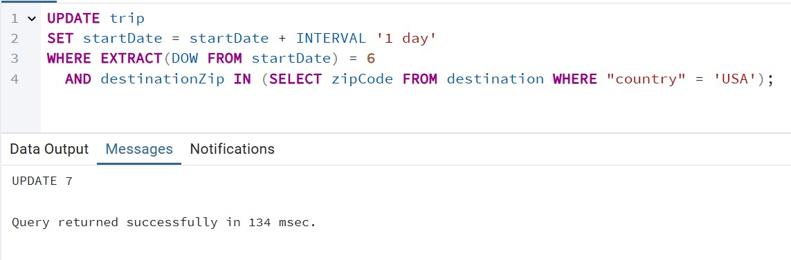

#### Before

#### After

### Rollback  
-עדכון בסיס הנתונים

-לפני Rollback

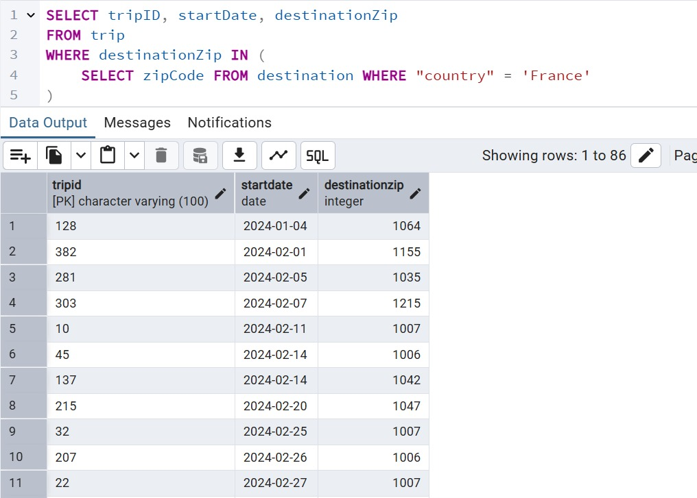

-אחרי Rollback 

### Commit  
-עדכון בסיס הנתונים

-לפני Commit

-אחרי Commit 

### Constraints 
-האילוצים:

-1.תיאור השינוי: נוסיף אילוץ Default כך שבעת הוספת שורה חדשה לטבלת invite ללא ציון ערך עבור totalCustomer, העמודה תקבל אוטומטית את הערך 1.

-2.תיאור השינוי: נוסיף אילוץ CHECK עבור העמודות startDate ו-endDate בטבלת trip. אילוץ זה מוודא שתאריך ההתחלה של הטיול תמיד יהיה מוקדם או שווה לתאריך הסיום שלו. זה מבטיח שלטיול יש משך זמן חיובי או אפס, ולא שהסיום יתרחש לפני ההתחלה.

-3.תיאור השינוי: נוסיף אילוץ UNIQUE עבור העמודה email בטבלת customer כדי לוודא שכל כתובת דוא"ל בטבלה תהיה ייחודית.

### Backupfile

📜[View `Backup2.sql`](ב/backup2.backup)

## Phase 2: Integration 

- בשלב באינטגרציה נדרשנו לבצע אינטגרציה של הנושא שלנו חברת טיולים עם נושא אחר שקיבלנו מלון.

###  DSD של האגף החדש
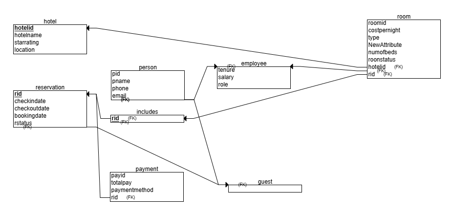

###  ERD אגף חדש
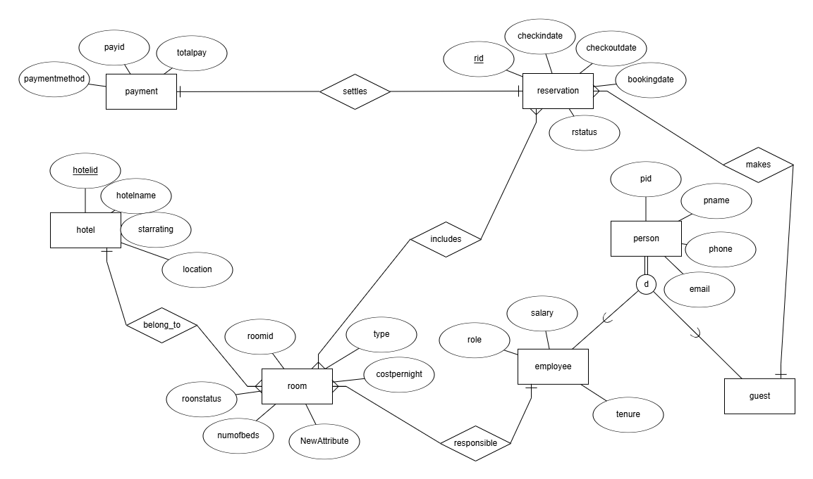

###    ERD משותף

### DSD לאחר אינטגרציה

Integration Report: Hotel and Travel Agency Databases
During the integration process between the hotel database and the travel agency database, the schema was unified to eliminate redundancy, maintain data integrity, and more accurately reflect real-world semantics. Here is a detailed summary of the changes:

# Defining Person as a Supertype
To unify entities related to Person, it was decided that:
-Person will be used as a supertype (superclass) from which Customer, Employee, and Guide will inherit.
-The Guest entity from the hotel database is aligned with Customer from the travel agency, and is therefore merged into Customer. The decision to retain Customer rather than Guest was based on the fact that the concept of "Customer" is broader and better fits the semantics of both systems.
-Person will retain the attributes id, fullname, email, and phonenumber, and its descendants will only have id.

# Renaming Columns for Consistency
-The following changes have been made across multiple tables to maintain consistent naming conventions:
In Person, the columns have been renamed:
pid → id
pname → fullname
phone → phonenumber
The pid column in Employee, Guest, and Responsible has been renamed to id.
The guestid column in Reservation has been renamed to id.
Converting Identifier Types to VARCHAR
-To support consistent formatting across systems, all identifier-related columns have been updated from INT to VARCHAR(100):
This includes the id, roomid, hotelid, rid, and payid fields in all relevant tables (Employee, Reservation, Responsible, Room, Hotel, Payment, Includes, and Settles).

# Dropping Foreign Keys Before Type Updates
-To allow for changes to column types, foreign keys were temporarily dropped from:
Employee, Guest, Reservation, Responsible, Includes, and Settles.
They were restored after the changes.

# Re-create Foreign Keys After Changes
-After all column names and types were updated, the foreign key constraints were redefined to ensure relational integrity:
employee.id → person.id
responsible.id → person.id
guest.id → person.id
reservation.id → person.id
includes.rid → reservation.rid
settles.payid → payment.payid
settles.rid → reservation.rid
includes.roomid → room.roomid
responsible.roomid → room.roomid

# Merge Guide and Customer into Person
To fully integrate all entities related to Person:
Data from Customer and Guide was inserted into the Person table (excluding duplicates).
After the migration, the columns fullname, email, and phonenumber were removed from Customer and Guide.

# Modify Guide Table
The guideName field was renamed to fullname.
An email field was added to match the Person structure.
# Change the Employee Table
The column names were changed to id, fullname, and phonenumber to match the Person structure.

# Update Hotel-Trip Relationships
The name of the Hotel entity in the travel agency was changed to Hotels to avoid name clashes.
The previous relationship between Trip and Hotel was reorganized:
Instead of directly relating Trip to Hotel, a many-to-many relationship was created between Trip and Reservation, allowing room reservations for a person per trip.
As a result of this restructuring, the previous relationship makes between Guest/Customer and Reservation was not retained. This is because in the integrated model, the trip, rather than the individual customer, is responsible for the reservation, which better reflects the business logic of a group booking.

# Merge Reservation with Trip
A new many-to-many relationship was created between Trip and Reservation.
The existing many-to-many includes (between Reservation and Room) and one-to-many belongs_to (between Room and Hotel) relationships were preserved.

# Merge Owner Relationships
The Responsible relationship (between Employee and Room) from the hotel database was incorporated into the unified schema.

# Change Payment Relationships
To reflect that payment is made per trip and not per booking:
The existing settles relationship (between Reservation and Payment) has been preserved.
Two new relationships have been added:
tripPay: Many-to-many between Trip and Payment
paid: One-to-many from Customer to Payment
This structure allows for trip-based payments that depend on room type, number of beds, and number of people.

# Add starRating to Hotel
The new starRating attribute has been added to the Hotel table, which was missing in the travel agency schema.
Data was consolidated from hotel to hotels accordingly.

# Unchanged Relationships from Travel Agency
All other existing relationships in the travel agency schema, such as Trip with Guide, Destination, Customer, and Flight, were not affected by the integration. They remain unchanged as they were not impacted by the unification process.

## Intgrate SQL 

You can find the SQL queries in the file [integrate.sql](ג/integrate.sql).

# Views
--המבט HotelReservations מאחד נתונים מטבלאות המלונות, החדרים, ההזמנות והקשרים ביניהם.
--הוא כולל רק הזמנות שהסתיימו (שהסטטוס שלהן הוא 'Completed') ומציג את כל המידע הקשור אליהן.
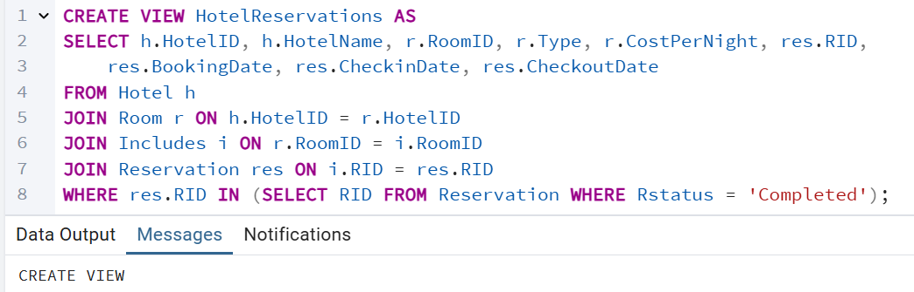

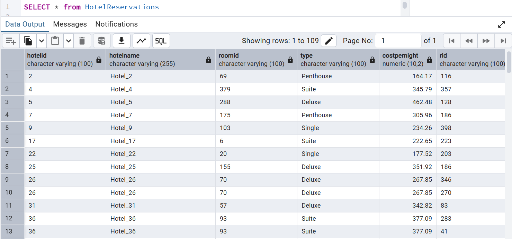

--  הצגת כל ההזמנות שבוצעו לחדרים מסוג "Double"

--רשימה של כל ההזמנות שהסתיימו ומחיר הלילה של החדר גבוה מ־200.

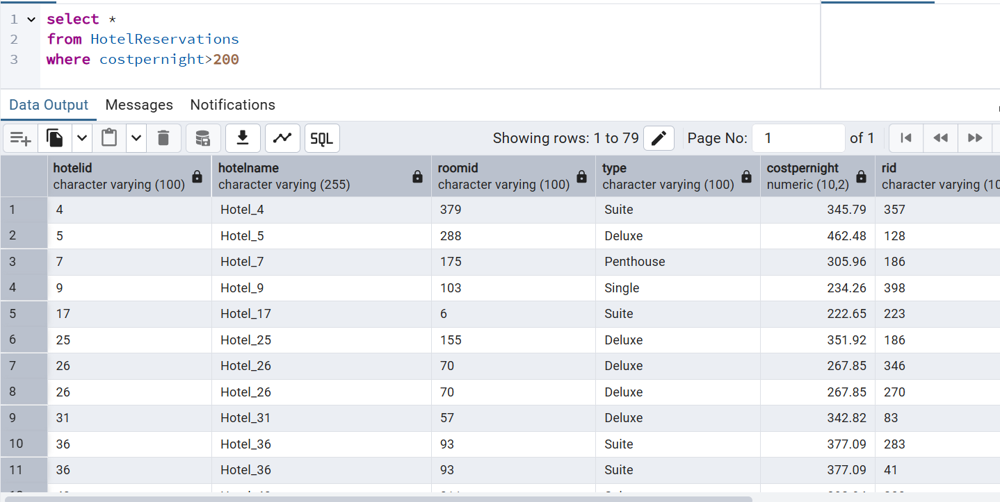

--יצירת View בשם TripDetails 
--מאחד טיולים עם פרטי המלון שאליו הם שויכו. כולל רק טיולים למלונות עם יותר מ־200 חדרים.

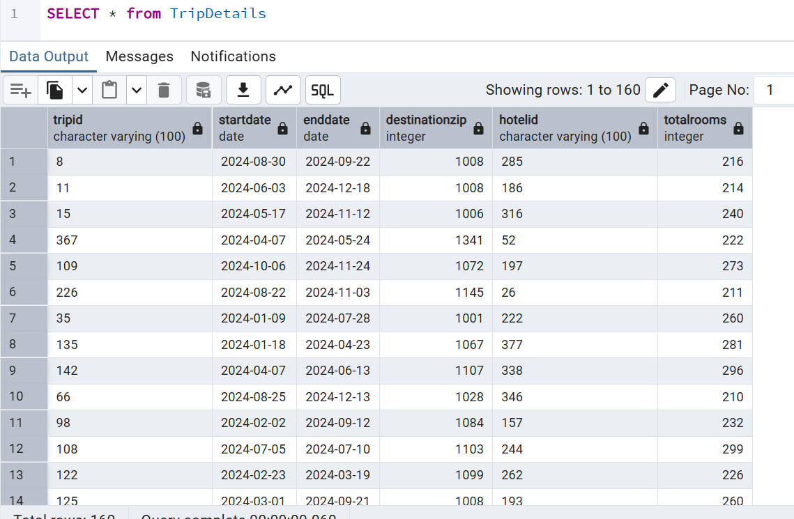

-- שאילתה שמחזירה את כל הטיולים מתוך TripDetails למלונות שיש בהם פחות מ-250 חדרים

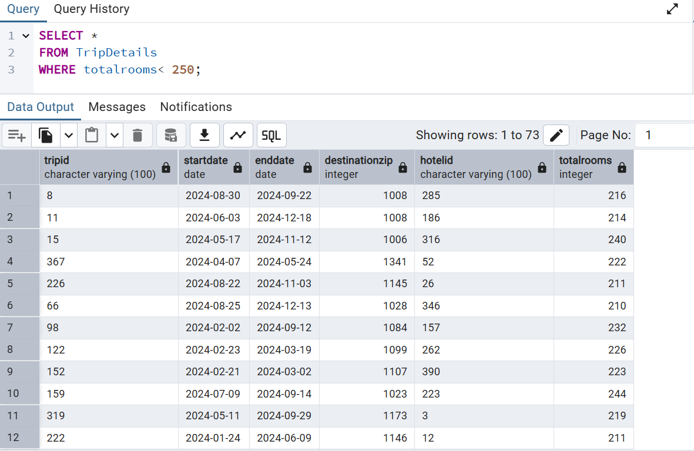

-- שאילתה שמחזירה את כל הטיולים מתוך TripDetails שהתחילו לפני 1 באוקטובר 2024 והסתיימו אחרי 1 באוגוסט 2024

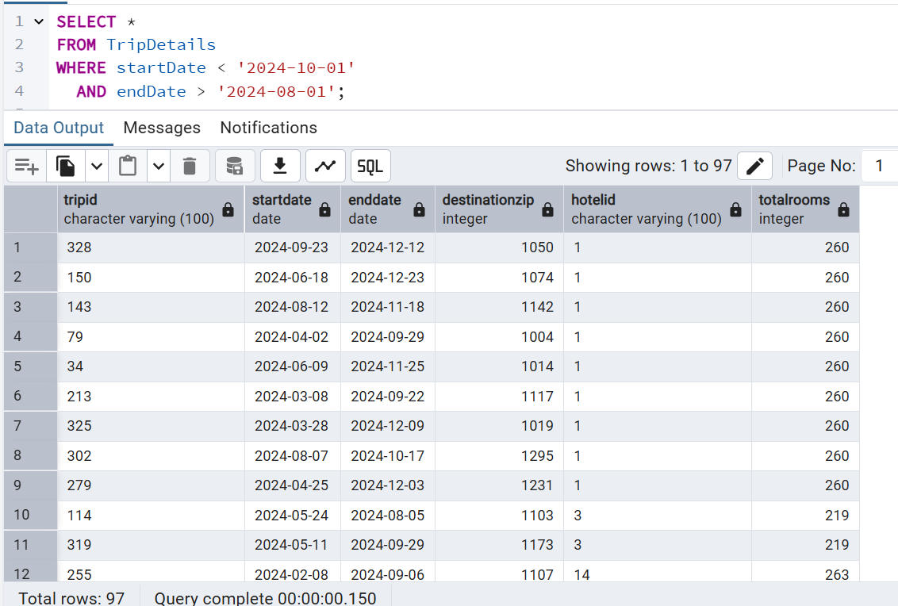

## Backupfile

📜[View `Backup3.sql`](ג/backup3.backup)

## Phase 3: Programming

